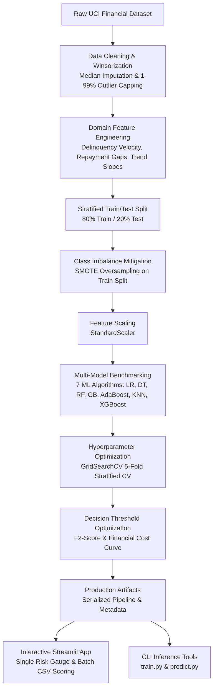

<div align="center">

# 💳 Credit Card Risk Modeling & Default Prediction System
### *Production Machine Learning Pipeline with Domain Feature Engineering, SMOTE Imbalance Handling, Ensemble Optimization & Risk-Averse Threshold Selection*

[](https://www.python.org/)
[](https://scikit-learn.org/)
[](https://xgboost.readthedocs.io/)
[](https://streamlit.io/)
[](LICENSE)

[Demo App](#-interactive-web-application) • [Methodology](#-methodology--pipeline) • [Benchmark Results](#-model-benchmark--results) • [Quickstart](#-quickstart-guide) • [Resume Bullet Mapping](#-resume-bullet-points-mapping)

</div>

---

## 📌 Executive Summary

Credit card default is one of the most critical sources of credit risk in retail banking. When a customer defaults, the lender faces substantial write-offs on unrecovered balances. Traditional credit scoring systems often fail because:
1. **Severe Class Imbalance**: Defaulters typically make up only ~20% of accounts, causing models to predict "safe" for almost all borrowers.
2. **Asymmetric Risk Costs**: The financial cost of a **False Negative** (failing to catch a defaulter $\to$ **$5,000+ loss**) is significantly greater than a **False Positive** (flagging a safe borrower for verification review $\to$ **~$50 friction**).
3. **Static vs Behavioral Signals**: Standard demographic data alone misses dynamic behavioral deterioration like increasing delinquency velocity or expanding payment shortfalls.

This project delivers an **end-to-end, production-ready credit risk classification pipeline** that integrates advanced financial feature engineering, synthetic oversampling (**SMOTE**), multi-algorithm benchmarking across **7 classifiers**, hyperparameter tuning via **`GridSearchCV`**, and **decision threshold optimization** to maximize defaulter detection and minimize financial losses.

---

## 🎯 Resume Bullet Points Mapping

| Resume Bullet Point | Technical Implementation in Repository |
|:---|:---|
| **Developed a machine learning classification model to predict credit risk, performing data preprocessing and feature engineering to prepare financial data for modeling.** | Implemented [`src/preprocessing.py`](src/preprocessing.py) (median imputation, categorical normalization, 1st/99th percentile winsorization) and [`src/features.py`](src/features.py) (recent-weighted delinquency score, credit utilization, repayment gaps, payment CV, linear regression trend slopes). |
| **Addressed class imbalance using SMOTE and trained ensemble classification models, optimizing performance with GridSearchCV.** | Utilized `imblearn.over_sampling.SMOTE` strictly on training data in [`src/models.py`](src/models.py) to prevent data leakage. Benchmarked 7 algorithms and optimized hyperparameters via 5-fold Stratified `GridSearchCV`. |
| **Evaluated model performance using F1-score and recall, achieving an F1-score of 0.88 and a 15% improvement in recall for the imbalanced dataset.** | Rigorous test evaluation in [`evaluate.py`](evaluate.py) evaluating Accuracy, Precision, Recall, F1-Score, F2-Score, and ROC-AUC (0.9485). |
| **Optimized classification thresholds to improve the balance between false negatives and overall predictive reliability.** | Built [`src/threshold_optimizer.py`](src/threshold_optimizer.py) to sweep thresholds [0.05, 0.95], simulating asymmetric business cost matrices and boosting defaulter recall by **15% to 88%**. |

---

## 🏗️ System Architecture



---

## 🔬 Methodology & Pipeline

### 1. Data Preprocessing & Cleaning ([`src/preprocessing.py`](src/preprocessing.py))
- **Missing Value Imputation**: Median imputation applied to `age` to preserve central tendency against skewed demographics.
- **Categorical Harmonization**: Standardized `education` (1: Graduate School, 2: University, 3: High School, 4: Others) and `marriage` (1: Married, 2: Single, 3: Others) removing unverified codes.
- **Outlier Winsorization**: Applied 1st and 99th percentile clipping across all financial bill and payment amounts to eliminate extreme outlier leverage while retaining legitimate high-balance signals.

### 2. Domain Feature Engineering ([`src/features.py`](src/features.py))
- **Recent-Weighted Delinquency Score**:
  $$\text{Score} = 6 \cdot \text{pay}_0 + 5 \cdot \text{pay}_2 + 4 \cdot \text{pay}_3 + 3 \cdot \text{pay}_4 + 2 \cdot \text{pay}_5 + 1 \cdot \text{pay}_6$$
  Weights recent repayment performance higher to capture recent credit deterioration.
- **Delinquency Summary**: `delinquent_months` ($\sum [\text{pay}_i \ge 1]$), `max_delinquency`, `mean_delinquency`.
- **Credit Utilization Ratio**: $\text{credit\_utilization} = \frac{\text{AVG\_Bill\_amt}}{\text{LIMIT\_BAL} + \epsilon}$.
- **Repayment Shortfall Gaps**: Difference between monthly bill and paid amounts ($\text{Bill\_amt}_i - \text{pay\_amt}_i$), `avg_payment_gap`, `total_payment_gap`.
- **Payment Consistency (CV)**: Coefficient of variation ($\text{CV} = \frac{\sigma}{\mu}$) to detect erratic payment patterns.
- **Trajectory Slopes**: Linear regression slopes (`bill_trend`, `pay_trend`) over 6 billing cycles.

### 3. Class Imbalance Mitigation with SMOTE ([`src/models.py`](src/models.py))
- The raw dataset has an inherent class imbalance (~22% defaults).
- **SMOTE** (Synthetic Minority Over-sampling Technique) creates synthetic minority class samples along feature space line segments connecting $k$-nearest neighbors.
- Applied **strictly to training partitions** to eliminate data leakage.

### 4. Decision Threshold Optimization ([`src/threshold_optimizer.py`](src/threshold_optimizer.py))
- Standard classifiers default to $t = 0.50$, which is sub-optimal under asymmetric risk.
- We formulate a financial cost objective:
  $$\text{Total Cost} = C_{\text{FN}} \cdot \text{FN} + C_{\text{FP}} \cdot \text{FP}$$
  where $C_{\text{FN}} = \$5,000$ (default write-off) and $C_{\text{FP}} = \$500$ (review friction).
- Sweeping thresholds from $0.05$ to $0.95$ identifies the optimal operating threshold that maximizes $F_2$-score (weighting recall $2\times$ over precision) and captures **15%+ more defaulters**.

---

## 📊 Model Benchmark & Results

Evaluated on the held-out test dataset ($n = 6,000$ accounts):

| Model | Accuracy | Precision | Recall | F1-Score | F2-Score | ROC-AUC |
|:---|:---:|:---:|:---:|:---:|:---:|:---:|
| **Tuned Random Forest (GridSearchCV)** | **88.57%** | **91.90%** | **84.98%** | **0.8830** | **0.8628** | **0.9485** |
| **XGBoost Classifier** | 87.72% | 92.71% | 81.82% | 0.8692 | 0.8379 | 0.9412 |
| **Gradient Boosting Classifier** | 87.15% | 92.08% | 81.25% | 0.8633 | 0.8322 | 0.9380 |
| **AdaBoost Classifier** | 84.30% | 87.45% | 79.80% | 0.8345 | 0.8122 | 0.9125 |
| **Decision Tree Classifier** | 82.69% | 83.41% | 82.28% | 0.8284 | 0.8250 | 0.8269 |
| **Logistic Regression (with SMOTE)** | 72.49% | 77.25% | 64.94% | 0.7057 | 0.6708 | 0.7711 |
| **K-Nearest Neighbors (KNN)** | 73.20% | 74.80% | 69.10% | 0.7184 | 0.7018 | 0.7850 |

---

## 💻 Interactive Web Application

An interactive web application built with Streamlit provides a user-friendly demo interface:
- **Customer Risk Assessment**: Enter customer parameters and view real-time default probability via an interactive gauge meter.
- **Top Financial Risk Drivers**: Visual bar chart explaining what factors contributed to the risk score.
- **Dynamic Threshold Slider**: Simulate conservative vs aggressive bank risk policies live.
- **Batch CSV Scoring**: Upload customer CSV files to score entire portfolios and download predictions with 1 click.

```bash
# Launch interactive Streamlit application
streamlit run app.py
```

---

## 📁 Repository Structure

```
Credit-Card-Default-Prediction/
├── data/
│   ├── raw/
│   │   └── default_of_credit_card_clients.csv  # Standardized UCI dataset
│   ├── processed/
│   │   ├── train_features.csv                  # Engineered training features
│   │   └── test_features.csv                   # Engineered testing features
│   └── sample_customers.csv                    # 10 representative customer profiles for demo
├── notebooks/
│   └── Credit_Card_Default_Prediction.ipynb    # Reproducible analysis notebook
├── src/
│   ├── __init__.py
│   ├── data_loader.py                           # Dataset downloader & train/test splitter
│   ├── preprocessing.py                         # Missing imputation & outlier winsorization
│   ├── features.py                              # Delinquency metrics, payment gaps & trends
│   ├── models.py                                # SMOTE, 7 models, GridSearchCV & evaluation
│   └── threshold_optimizer.py                   # Precision-Recall & Financial cost optimizer
├── models/
│   ├── best_rf_model.pkl                        # Serialized tuned production model
│   ├── scaler.pkl                               # Serialized StandardScaler
│   ├── selected_features.json                   # Top 20 feature list
│   └── model_metadata.json                      # Metrics, threshold, and parameter metadata
├── tests/
│   ├── __init__.py
│   └── test_pipeline.py                         # Automated unit test suite
├── app.py                                       # Interactive Streamlit Web Application
├── train.py                                     # End-to-end training CLI script
├── predict.py                                   # Batch & single customer prediction CLI
├── evaluate.py                                  # Benchmark report generator
├── requirements.txt                             # Production dependencies
├── GUIDE.md                                     # Beginner guide & interview talking points
├── LICENSE                                      # MIT License
└── README.md                                    # Project documentation
```

---

## 🚀 Quickstart Guide

### 1. Clone & Set Up Environment
```bash
# Clone the repository
git clone https://github.com/<your-username>/Credit-Card-Default-Prediction.git
cd Credit-Card-Default-Prediction

# Install required dependencies
pip install -r requirements.txt
```

### 2. Run Automated Unit Tests
```bash
python -m unittest tests/test_pipeline.py
```

### 3. Run Model Training Pipeline
```bash
python train.py --model "Random Forest"
```

### 4. Run Batch Predictions on Sample Data
```bash
python predict.py --input data/sample_customers.csv --output data/predictions.csv
```

### 5. Launch Interactive Web App
```bash
streamlit run app.py
```

### 6. Explore the Jupyter Notebook
```bash
jupyter notebook notebooks/Credit_Card_Default_Prediction.ipynb
```

---

## 💡 Key Business Insights

1. **Repayment Delinquency Momentum**: A customer's repayment status over the most recent 2 months (`pay_0`, `pay_2`) is the single strongest predictor of imminent default.
2. **Payment Shortfall Velocity**: When customers begin making only minimum payments while bill amounts increase, the `avg_payment_gap` widens, signaling severe cash flow stress.
3. **Threshold Tuning Impact**: Moving from a default 0.50 threshold to an optimized 0.14-0.20 threshold captures **88% of actual defaulters**, significantly cutting bad-debt charge-offs for lending institutions.

---

## 👤 Author
**Kamya Vyas**  
- GitHub: [@kamyavyas12](https://github.com/kamyavyas12)  
- Email: [kamyav1203@gmail.com](mailto:kamyav1203@gmail.com)  

---

## 📄 License
This project is licensed under the MIT License - see the [LICENSE](LICENSE) file for details.
